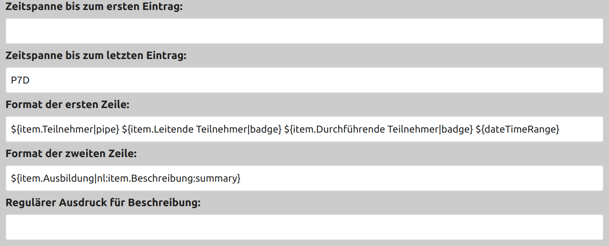

# Configuration

The timestamps need to be specified in [ISO "period" format](https://en.wikipedia.org/wiki/ISO_8601#Durations), e.g. `P30D` for 30 days.

Shell-like `${...}` placeholders are used for the format rows per appointment.

Possible placeholders are:

* `${startDate}` - the start day of the event
* `${endDate}` - the end day of the event
* `${dateTimeRange}` - a data time range for the event, omitting the end date if it is the same day
* `${dateRange}` - a date range (without time) if the event spans multiple days, start date other wise
* `${summary}` - the title line of the event
* `${description}` - the complete description body of the event
* `${0} ... ${n}` - if the regular expression contains placeholders, they can be addressed by just their number
* `${item.XYZ}` - for a line in the description starting like `XYZ:` something, this would contain something
* `${*}` - outputs all known placeholders as JSON for debugging

Additionally, filters can be applied to each placeholder value like `${...|filter1|filter2}`.
The following filters are supported:

* `${...|badge}` will put each line of the value in square brackets `[]`
* `${...|pipe}` will separate the lines of the value by a pipe `|`
* `${...|slash}` will separate the lines of the value by a slash `/`
* `${...|nl}` will separate the lines of the value by a newline
* `${...|dash}` will separate the lines of the value by a newline and a dash `-`
* `${...|dash2}` will separate the lines of the value by a newline and a double dash `--`
* `${...|dash3}` will separate the lines of the value by a newline and a triple dash `---`

If a placeholder cannot be resolved, a fallback can be specified using the colon charater `:`, otherwise the value will be empty.
E.g. `${a:b:c}` would output the value of `b` if `a` is undefined or `c` if `a` and `b` are undefined.

Example:

